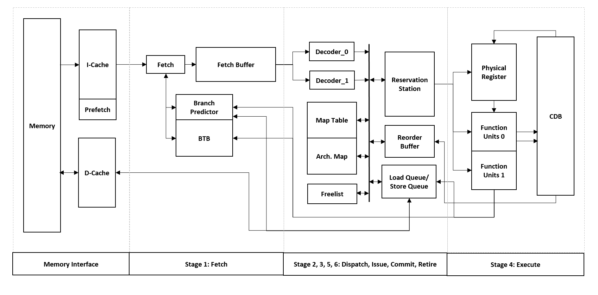

# Alpha64_R10000
Alpha64 R10000 Two-Way Superscalar Processor

Top Level Architecture:

Features:
* R10K OoO
* 2-way superscalar
* Load-Sore Queue (Speculative Load, Store-to-load forwarding)
* Non-blocking pipelined multi-stage multipiler
* Non-blocking cache with Miss Status Handling Register
* Prefetching
* Branch Predictor
